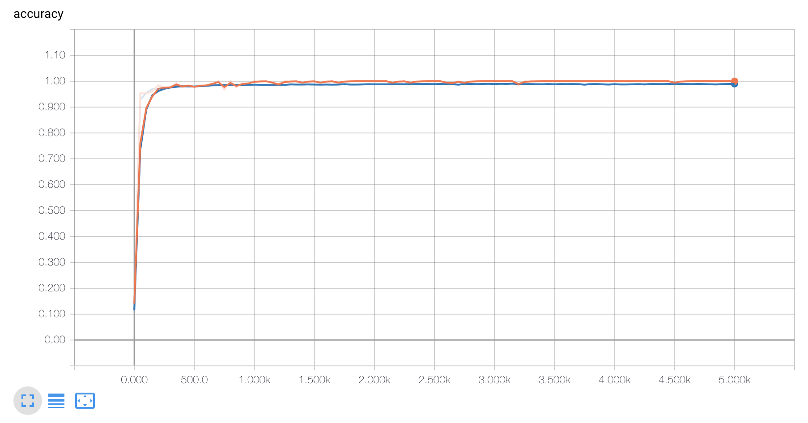

# Machine Learning Digit Recognition
This repository includes a really simple machine learning algorithm for digit recognition based in the famous MNIST dataset. 

### Data
MNIST Dataset downloadable from [kaggle competition](https://www.kaggle.com/c/digit-recognizer/data).

### Approach
My approach to solving this challenge was to use a Convolutional Neural Network.

#### Graph
- Reshape input into [28, 28, 1]
- Convolutional layer No. 1 | Kernel = [5, 5, 1, 32] | Stride = [1,1,1,1] | Activation function = ReLU
- Max pool layer No. 1 | Kernel = [1, 2, 2,1] | Stride = [1, 2, 2,1]

- Convolutional layer No. 2 | Kernel = [5, 5, 32, 64] | Stride = [1,1,1,1] | Activation function = ReLU
- Max pool layer No. 2 | Kernel = [1, 2, 2,1] | Stride = [1, 2, 2,1]

- Flatten output from the dropout layer
- Fully Connected layer | Nodes = 1024 | Activation function = ReLU
- Dropout layer
- Fully Connected layer | Nodes = 10 | (output layer)

### Training
In order to train the model, I used softmax cross-entropy as a loss function, taking the mean of it to optimize the model. The optimizer I chose is Adam optimizer with a learning rate of 0.001. In order to train the model, I used an 8 CPUs instance in GCP, training for 5000 steps. 

#### Accuracy graph

### Results
After training the model for 5000 steps I got *99.085% of accuracy* on the test set provided by Kaggle.

### References
- https://www.tensorflow.org/guide/

### Dependencies
- tensorflow
- python
- numpy
- pandas
- matplotlib

### Authors
Juan Pedro Casian - Github: [@JuanCasian](https://github.com/JuanCasian) - Email: juanpedrocasian@gmail.com
